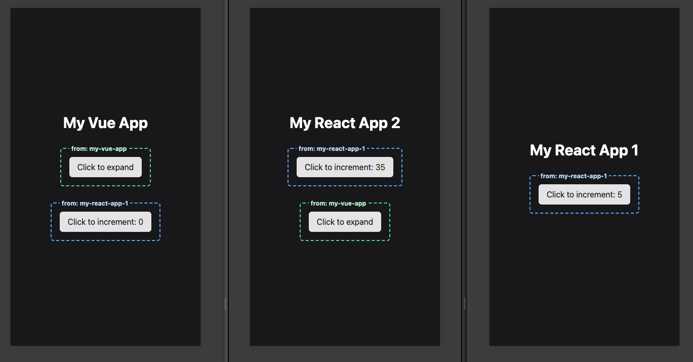

# 🚀 Micro Frontend Study Case

Welcome to the Micro Frontend Study Case repository! This repository serves as a demonstration of implementing micro frontends using React and Vue.js.



## Overview

Micro frontend architecture is an approach to frontend development where a single web application is composed of multiple smaller, independent applications, each owning its UI and logic. This study case explores how to integrate React and Vue.js applications as micro frontends within a unified user experience using module federation with Vite.

## Technologies Used

- React.js ⚛️
- Vue.js 🖖
- Vite 🛠️
- TypeScript 📝
- Tailwind 🪁

## Folder Structure

The repository is structured as follows:

- `/my-react-app`: Contains a React application
- `/my-react-app-2`: Contains a second React application.
- `/my-vue-app`: Contains a Vue.js application

## How to run

Run the first react app that provides a component

```shell
  cd ./my-react-app && pnpm i && pnpm run build && pnpm run preview 
```

Run the vue app that provides a component

```shell
  cd ./my-vue-app && pnpm i && pnpm run build && pnpm run preview 
```

Run the second react application that will use all the components

```shell
  cd ./my-react-app-2 && pnpm i && pnpm run dev 
```